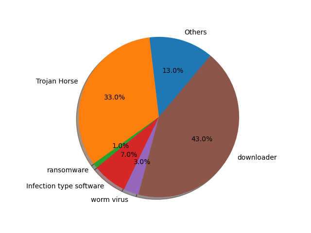

Introduction
----------

Name:Encryption malicious traffic analysis and testing platform

### Background

With the popularity of HTTPS in recent years, the proportion of encrypted malicious traffic attacks is gradually increasing. According to the report, at present, the malware for encrypted communication has basically covered all types of attacks, such as Trojan horse, blackmail software, infective, worm virus, downloader, etc. among them, the malware family of Trojan horse and downloader accounts for a relatively high proportion.

 

The commonly used software encryption communication methods can be roughly divided into six types:
|Type|Means of Attack|
|-------|--------|
|Trojan Horse|C&C direct connection,White stands hidden transfer,Others|
|ransomware|C&C direct connection|
|Infection type software|C&C direct connection,normal discharge|
|worm virus|C&C direct connection,worm propagation|
|downloader|White stands hidden transfer,Others|

### Current Work

1. Normal flow sample collection based on scapy（ getgoodx.py ）And the analysis of large-scale attack sample packets (pcap);
2. Data cleaning, filtering and Feature Engineering (this is a very difficult step, because the quality of Feature Engineering basically determines the upper limit of model quality)
3. A variety of different machine learning models, based on the business requirements of maintainability and interpretability of security attack and defense system, focus on SVM, random forest and integrated learning algorithm. The landing business scenarios of these three models are very different, which will be explained later.

### SpotLight

-The first domestic open source analysis and detection platform of encrypted malicious traffic based on machine learning method
-Considering the existing feature engineering as much as possible, and combining with NLP, a new feature engineering method different from word frequency (TF) is proposed
### Todolsit

-[] support for a custom neural network model (Deep is all you needed?)
-[] not limited to the keyword detection commonly used in the industry. The emotional analysis tools such as nltk are added to NLP to better reflect the statistical characteristics
-[] training of larger datasets, supporting relational databases, such as MySQL
-[] front end detection page based on the flask framework

If you have any question or suggestion, Please email us :)

### Enviroment

 Support Python 3.0+
 
 You may install Winpcap,if you want to run the section of getting samples,by the way,it's easy to install the software.

### Deployment procedure

Easy to use.....

CONECTION
-----------
email: **xmfeng2000@126.com**

地址: Xidian University,Xi'an,China

LICENSE
-------
MIT License

Copyright (c) 2021 Xinmin Feng & Minyi Li