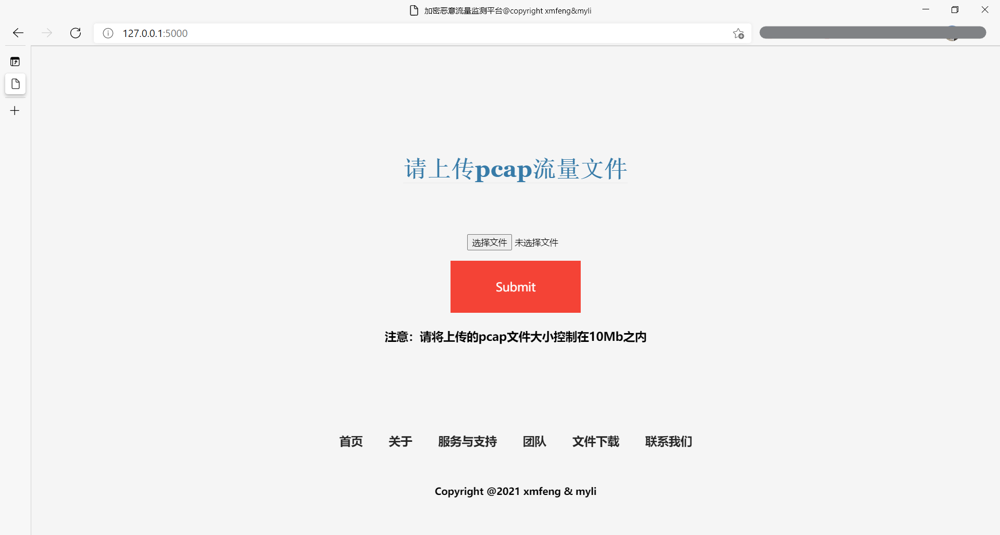
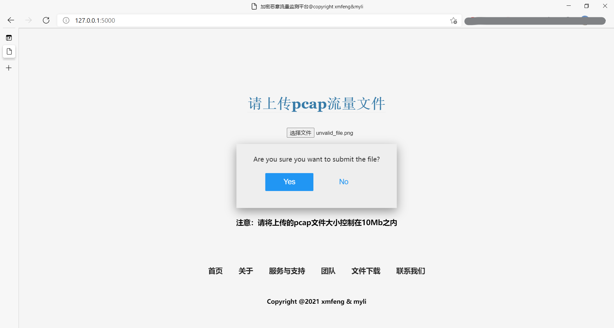
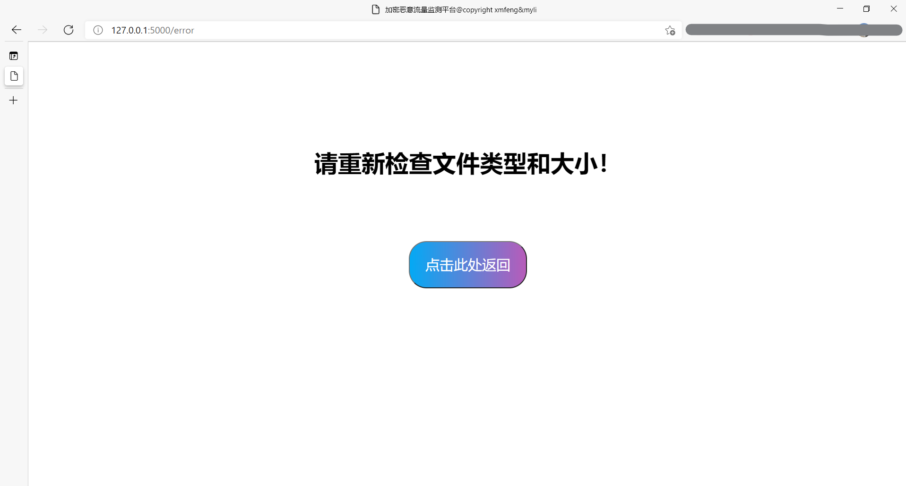
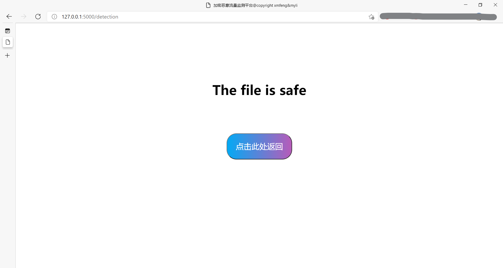

# README

软件名称：基于机器学习的加密恶意流量分析与检测平台

维护状态：**持续更新中**

### 背景介绍

随着近年来HTTPS的普及，加密恶意流量攻击的比例也在逐渐提升。根据报告,目前加密通信的恶意软件基本已经覆盖所有的攻击类型，例如特洛伊木马、勒索软件、感染式、蠕虫病毒、下载器等，其中特洛伊木马和下载器类的恶意软件家族占比较高。

 

常用的软件加密通信方式，可以粗略地分为六种：

|Type|Means of Attack|
|-------|--------|
|Trojan Horse|C&C direct connection,White stands hidden transfer,Others|
|ransomware|C&C direct connection|
|Infection type software|C&C direct connection,normal discharge|
|worm virus|C&C direct connection,worm propagation|
|downloader|White stands hidden transfer,Others|


### 快速上手

关键代码部分的文件目录：

```
malicious_traffic_detection_platform.traffic_platform
  |
  |_______ train_test (模型训练/预测)   
  |          |____ dataset (清洗完毕的特征集)
  |          |          |____ badx.csv (正常流量特征)
  |          |          |____ goodx.csv (异常流量特征)
  |          |____ protocol (协议解析模板)
  |          |          |____ ETHER
  |          |          |____ FILES
  |          |          |____ IP
  |          |          |____ PORT
  |          |          |____ UDP
  |          |          |____ TCP
  |          |          |____ WARN
  |          |____ safe_pcap (Folder)
  |          |
  |          |____ __init__.py
  |          |____ main.py (模型训练入口，支持args参数传入)
  |          |____ get_goodx.py (监听并根据协议模板自动解析本机HTTPS流量包，存储为goodx.csv)
  |          |____ get_badx.py (根据协议模板自动解析本地pcap流量包，存储为badx.csv)
  |          |____ get_feature.py (对goodx.csv和badx.csv的特征工程)
  |          |____ 抓包协议分析器.py (基于tkinter和scapy实现的模仿抓包工具wireshark的抓包平台)
  |          |
  |          |____ model.pkl
  |_______ web_platform (基于Flask框架的前端界面)
  |          |____ __init__.py
  |          |____ runserver.py (程序入口)
  |          |____ setting.py (配置文件)
  |          |____ controller (业务视图)
  |          |          |____ ————init__.py
  |          |          |____ message.py  (存放WSGI的构造函数)
  |          |____ User_Info.sqlite3  (MySQL)
  |          |____ pcap_test(测试pcap文件夹)
  |          |____ static (静态文件)
  |          |          |____ css(Folder)
  |          |          |____ fonts(Folder)
  |          |          |____ js(Folder)
  |          |____ tempaltes (模板)
  |          |          |____ logout.html
  |          |          |____ login.html
  |          |          |____ show_entries.html
  |          |          |____ show_error.html
  |          |          |____ upload.html
  |          |          |____ button.html
  |          |          |____ wait.html
  |          |          |____ result.html
  |          |____ model (SQL)
  |          |          |____ Category.py
  |          |          |____ User.py
  |_______ model.pkl
```

模型训练:

    1. cd到traffic_platform目录下
    
    2. 键入 python -m traffic_platform.train_test.main  --train --updata_goodset=True --updata_badset=True

 模型预测结果（不需训练）：

    1. cd到traffic_platform目录下
    
    2. 键入 python -m traffic_platform.train_test.main  --train

 基于Flask的流量监测平台

    1. cd到traffic_platform目录下
    
    2. 键入python -m traffic_platform.web_platform.runserver

   


### 当前的工作结果

1. 基于Scapy的正常流量样本的采集（getgoodx.py）,以及对于大规模攻击样本数据包的解析(pcap);

2. 数据清洗、过滤和特征工程（这是非常困难的一个步骤，因为特征工程的好坏基本决定了模型的质量上限）

3. 多种不同的机器学习模型,基于安全攻防系统的可维护性和可解释性的业务要求，重点是SVM、随机森林以及集成学习算法，这三者的落地业务场景十分不同,后续版本后说明。

4. 用户友好的基于Flask的流量文件上传和监测界面

**各类模型的预测精度**

|Method|F1-Score(%)|Precision(%)|
|------|---------|-----|
|Random Forest|91.01|92.26|
|伯努利贝叶斯|89.81|91.3|
|Decision Tree|87.7|90.25|
|linear regression|88.25|88.89|
|linerSVC|77.13|81.57|
|多项式贝叶斯|64.25|67.27|

其中，综合效果最好的方法是随机森林算法,F1得分稳定在90%以上,这和[文献](https://blog.riskivy.com/%e5%9f%ba%e4%ba%8e%e6%9c%ba%e5%99%a8%e5%ad%a6%e4%b9%a0%e7%9a%84%e6%81%b6%e6%84%8f%e8%bd%af%e4%bb%b6%e5%8a%a0%e5%af%86%e6%b5%81%e9%87%8f%e6%a3%80%e6%b5%8b/)所说的是相同的，当然这其实与我们的业务场景密切相关。

**用户界面&操作逻辑（测试环境为Chrome 90.0.4430.212（64 位）版本）**

主界面：选择文件并点击submit，二次确认上传文件






后台会对文件大小和类型进行筛选，对于大小超过10MB或非pcap文件返回**请重新检查文件类型和大小**,点击返回键回到主页面（之所以限定10MB，主要是受限于目前的服务器性能，不能承受大流量高并发的需求，后续会进行改进）



当正确上传文件之后，系统会自动调用已训练好的模型和analysis函数（目前需要在内部输入抓取流量包的数量，后续会增加图形化界面的参数输入），并返回流量包是否正常（如下图所示）



### 亮点

- 国内为数不多的开源的基于机器学习方法的加密恶意流量分析与检测平台
- 多种协议模板(TCP UDP IP EHER PORT WARN)，能够抓取数据更多类型更加丰富的流量数据
- 支持对200MB及以上的pcap文件的协议解析
- 完整的结合词频(TF)分析法对流量文件的特征工程
- 模块化的协议解析类、特征工程、模型训练预测的API，具有较好的借鉴作用
- 基于Flask的友好简洁的流量文件上传解析界面


### Todolsit

- [ ]   支持自定义神经网络模型（基于深度的方法目前还不是很成熟），完善集成学习模型，并针对不同的应用场景给出不同的部署建议
- [ ]   不限于业界常用的关键词检测和TF特征,加入NLP的情感分析工具,例如NLTK等方法,更好的体现统计特性
- [ ]  完善数据库，支持高并发
- [ ]  更友好的交互方式（增加留言板、用户登录）


If you have any question or suggestion, Please email us :)

### 依赖的第三方库和环境配置


本项目支持Python3.0及以上的版本。

依赖的**第三方库**

```buildoutcfg
threading,tkinter,scapy,numpy,datetime,sklearn

socket,joblib,matplotlib,pprint,argparse

flask,flask_sqlalchemy

```

**环境依赖**


 ```
1. 如果你想运行正负样本数据包采集的代码(getgoodx.py,getbadx.py),你可能需要先下载winpcap软件，这个软件非常容易下载安装，当然你可以使用其他可以接获流量包的软件。

2. 恶意流量文件需要自行下载到traffic_platform/train_test/danger_pcap下，并在运行命令后新增加 --bad_pcap_dir=恶意流量文件地址

3. 将traffic_platform\web_platform\setting.py 添加到环境变量 FLASKR_SETTINGS

3. 前端仅支持HTML5,尚未对更低版本兼容

 ```


联系方式
-----------
email: **xmfeng2000@126.com**

地址: Xidian University,Xi'an,China


许可证明
-------
MIT License

Copyright (c) 2021 Xinmin Feng & Minyi Li